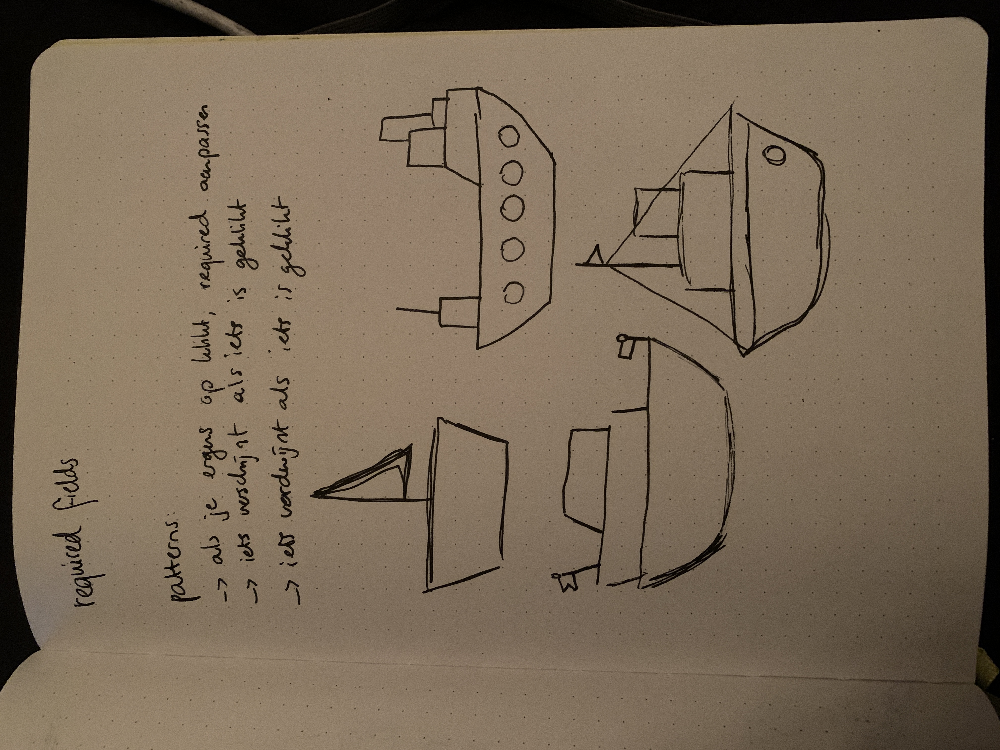

ja hoi lieve belastingdienst, mijn absolute favoriete overheidsinstantie ooit, dit is een schoolopdracht voor cmd amsterdam en geen phishing site.

# belastingdienst

## ik heb nagedacht

dat was namelijk de opdracht toen we begonnen. 'bewijs dat je hebt nagedacht'. nou, hier is het bewijs!

## feedback gesprekken

- show hide script schrijven
- formulier validatie & error handling
- ‘ga naar vraag 3’ zooi moet weg als JS aan staat
- data-showhide om aan te tonen welke radio buttons show en hide moeten krijgen

validatie → onblur met js foutmelding erin klappen, data-error?

als js aanstaat → required weghalen (removeAttribute)

data-required

bedrag veld met euro unit ervoor, puntjes na elke 3 getallen ? van rechts naar links

2 a 3 helpteksten → hele korte en hele lange, om te kijken of je systeempje werkt, verder lorem ipsum, onderaan pagina of andere pagina voor de helpteksten als js uit staat, details summary

data-helptekst?

:has()

localstorage

user-valid

screenreader

voorletters → uppercase text transform

liberal in what you accept from the user.

showing → default

hidden → :has. the complex selector should do the more destructive thing.

.togglecontent display:flex, when should it be hidden? when checkbox isnt checked

hideable

regular expressions

## hoe vond je nou zelf dat het ging eva

ja, niet zo goed.

maar ik ben uiteindelijk wel echt tevreden met wat ik in de laatste dagen nog heb neer kunnen zetten. ik vond het zelf vooral heel erg lastig om iedereen om me heen zo veel javascript te zien schrijven, waardoor ik het gevoel had dat ik dat ook moest doen maar dat kan ik niet en dus ging ik als een ware struisvogel maar gewoon mn kop in t zand steken en niks doen.

uiteindelijk heeft niels me gered door me op weg te helpen met show/hide en een beetje validatie met css. en omdat css me blij maakt, maakte dat me ook weer een beetje hoopvol.

uiteindelijk was het zelfs ook nog best leuk om een beetje te puzzelen met verschillende styling dingetjes. maar ik denk niet dat ik bij de belastingdienst wil werken later als ik groot ben.

## bronnen

- https://www.w3schools.com/jsref/prop_style_display.asp
- https://developer.mozilla.org/en-US/docs/Web/CSS/@supports
- https://www.youtube.com/watch?v=hG0YDpePCjI
- https://quirksmode.org/presentations/Spring2017/formvalidation_CSSDay.pdf
- https://developer.mozilla.org/en-US/docs/Learn/Forms/Form_validation
- https://css-tricks.com/form-validation-ux-html-css/
- https://careerkarma.com/blog/css-hide-element/#:~:text=You%20can%20hide%20an%20element,keeping%20the%20space%20the%20same.
- https://developer.mozilla.org/en-US/docs/Web/CSS/:has
- https://cmda-minor-web.github.io/css-to-the-rescue-2324/index.html
- https://www.matuzo.at/blog/2022/100daysof-day6/
- https://ishadeed.com/article/css-has-guide?utm_source=CSS-Weekly&utm_medium=newsletter&utm_campaign=issue-580-february-28-2024
- https://developer.chrome.com/blog/has-m105?hl=nl
- https://scroll-driven-animations.style/
- https://stackoverflow.com/questions/61235354/form-validation-on-blur/61236115#61236115
- https://stackoverflow.com/questions/61235354/form-validation-on-blur/61236115#61236115
- https://stackoverflow.com/questions/21469551/form-doesnt-redirect-to-another-page-in-html
- https://formvalidation.io/guide/examples/changing-success-and-error-colors/
- https://wordpress.com/forums/topic/how-to-open-custom-html-link-to-open-in-new-tab/#:~:text=You%20can%20make%20a%20HTML,this%20after%20the%20link%20address.
- https://www.w3schools.com/html/html_favicon.asp
- https://www.belastingdienst.nl/wps/wcm/connect/nl/home/home

- chatgpt <3 ik heb hem dit allemaal gevraagd en soms was het echt onzin en soms redde hij mijn nekje:

  - position sticky doesnt work here?
    nav ol {
    display: flex;
    justify-content: center;
    gap: 2rem;
    list-style: none;
    padding: 1rem 0;
    position: sticky;
    }

  - i want that when the bottom of the viewport hits #vraag-1, the a=href="#vraag-1" gets an active class. same for vraag-2. also when the user scrolls back up, the active classes should get removed. (insert code)
    - only the first section is a section, 2 and 3 are fieldsets!
    - okay but now the first 'section' isnt participating. find a way around this. im not going to change the html tags bc you are dumb and that wouldn't be semantic html.

- create a javascript function to put all of the input fields into local storage in a single object.
  (dit werkte echt niet hahahahahah ik heb het van klasgenoten afgekeken uiteindelijk want snapte er geen hol van)
